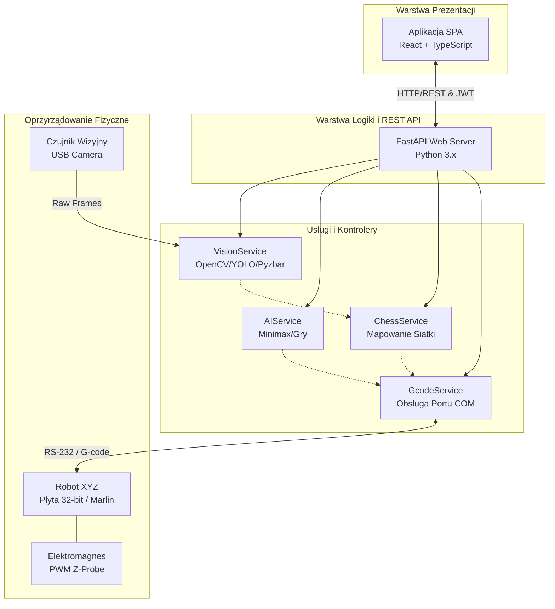

# Architektura Systemu — Primus Warehouse 2026

Dokument ten opisuje architekturę logiczną i technologiczną systemu magazynowania opartego na robocie kartezjańskim (Drukarka 3D). Jest on podzielony na warstwy obsługiwane przez dedykowane zespoły (Frontend, Backend, Hardware/AI).

## 1. Wykres Przepływu Danych (Data Flow)

Poniższy diagram ilustruje pełną pętlę sprzężenia zwrotnego w systemie: od interakcji użytkownika, przez bramę API, po port szeregowy sterujący silnikami krokowymi i odczyt z czujnika wizyjnego.

## 2. Warstwa Prezentacji (Frontend) — [Realizacja: Osoba A]
Aplikacja kliencka to nowoczesne SPA (Single Page Application) ukierunkowane na natychmiastową responsywność u użytkownika końcowego.
- **Stack Technologiczny**: React 18, Vite, TypeScript, Tailwind CSS, Lucide Icons, Shadcn UI.
- **Nawigacja i Role (RBAC)**: Dostęp oparty na rolach. Widoki i komunikacja z maszynami (`Plansza Magazynu`, `Szachownica`, `TicTacToe`) są odblokowywane wyłącznie dla użytkowników z asercją roli `ADMIN` za pośrednictwem modułu `AuthProvider`.
- **Zarządzanie Stanem**: Fetchowanie i cache'owanie danych realizowane za pomocą biblioteki `React-Query` (użytej od Etapu 2).
- **Interfejs Użytkownika**: Responsywne, nieblokujące UI (m.in. globalny bloker ekranu podczas długiej operacji przejazdu drukarki z zachowaniem obracających się Loader'ów informujących o poprawności połączenia sieciowego).

## 3. Warstwa Biznesowa i API (Backend) — [SEKCJA DO UZUPEŁNIENIA: Osoba B]
- **Stack Technologiczny**: [TODO: Opisać wersję Pythona, framework np. FastAPI, serwer ASGI (Uvicorn)].
- **Architektura Bazy Danych**: [TODO: Diagram klas/tabel w przypadku zapisu stanu szachownicy pomiędzy restaratmi (PostgreSQL/SQLite)].
- **Zarządzanie Usługami (DI)**: [TODO: Wyjaśnienie, w jaki sposób wstrzykiwane są klasy zależne, np. w jaki sposób kontroler szachów korzysta z instancji komunikatora Serial bez jej blokowania].
- **Kolejkowanie Zadań**: [TODO: Mechanizm obsługi długich żądań ruchu (np. `Celery` lub asynchroniczne pętle `asyncio`), zapobieganie timeoutom po stronie przeglądarki klienta].

## 4. Warstwa Robotyki i AI (Hardware & Vision) — [SEKCJA DO UZUPEŁNIENIA: Osoba C]
- **Komunikacja G-Code**: [TODO: Lista obsługiwanych dyrektyw sprzętowych m.in. G28, G1, M106, M107, M114, odpytywanie o stan portu szeregowego pyserial (Baudrate 115200/250000)].
- **Mechanizm Rozpoznawania (Vision)**: [TODO: Logika klatka-po-klatce z OpenCV. Zasada dobierania metody: skaner kodów QR `pyzbar` (dokładność absolutna) kontra model sieci neuronowej obiektowej (YOLO) dla piktogramów graficznych].
- **Bezpieczeństwo Maszyny**: [TODO: Opis mechanizmów `Software Endstops` uniemożliwiających uderzenie karetki druku o konstrukcje podczas błędnych komend, zarządzanie grzaniem stołu/głowicy (powinno być trwale wyłączone hardware'owo lub zablokowane programowo)].

## 5. Standaryzacja i Zabezpieczenia (Security)
- Wszystkie endpointy finałowe dziedziczą autoryzację tokenami JWT wypracowaną w Etapie 2.
- Aplikacja frontendowa zawiera odporność na awarie sieciowe (Graceful degradation) – zrywane gniazdo z backendem wyświetla "Zrestartuj połączenie" zamiast uszkodzić drzewo widoku.
